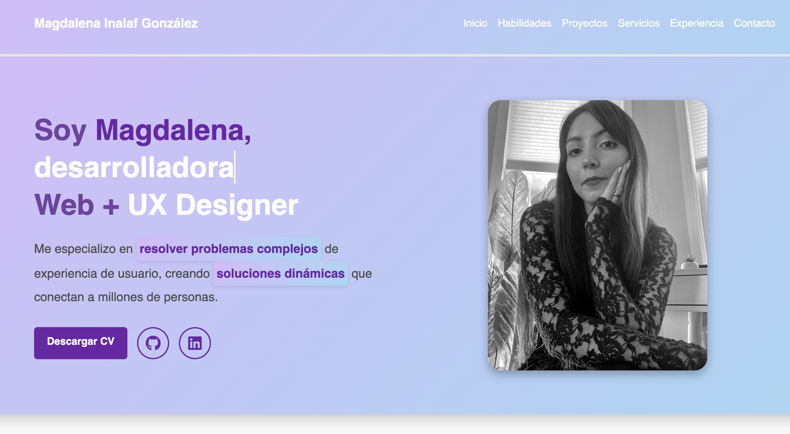

# Magdalena Inalaf | JavaScript Bootcamp Portfolio

Este portafolio fue desarrollado como parte del módulo del Bootcamp de JavaScript. Incluye mini-proyectos y ejercicios realizados para aplicar los conocimientos adquiridos en HTML, CSS, JavaScript, jQuery, Bootstrap y control de versiones con Git y GitHub.

---

## Sitio en línea

🔗 https://magdaig.github.io/portafoliojs/

---

## Tecnologías utilizadas

- HTML5
- CSS3
- Bootstrap 5
- JavaScript
- jQuery
- AOS (Animate on Scroll)
- Git y GitHub

---

## Habilidades demostradas

Estructuración semántica con HTML5  
Estilos personalizados y responsividad con CSS y Bootstrap  
Manipulación del DOM con JavaScript  
Manejo de eventos e interactividad con jQuery  
Uso de animaciones con AOS  
Validación de formularios  
Control de versiones con Git  
Repositorio remoto y documentación con GitHub

---

## Estructura del proyecto
portafoliojs/
├── index.html
├── assets/
│   ├── css/
│   │   └── styles.css
│   ├── js/
│   │   └── script.js
│   ├── img/
│   │   ├── profile.jpeg
│   │   ├── purpose.png
│   │   ├── cineflash-snippet.png
│   │   ├── librolibre-snippet.png
│   │   └── journey/
│   │       ├── htmlcss.png
│   │       ├── vue.png
│   │       └── next.png
│   └── pdf/
│       └── CV_Magda_English.pdf

---

##  Proyectos destacados

### CineFlash

> Simulador de reservas de cine con validación de formularios, modales, y feedback dinámico.

🔗 [Ver CineFlash](https://magdaig.github.io/cineflash-reservas/)

---

### LibroLibre

> Catálogo de libros con sistema de búsqueda dinámica, botones de acción, y tarjetas responsivas.

🔗 [Ver LibroLibre](https://magdaig.github.io/libros-catalogo-web/)

---

##  Mi evolución

| Año  | Proyecto        | Tecnología     |
|------|------------------|----------------|
| 2023 | HTML/CSS Site    |  |
| 2024 | Vue Portfolio    |  |
| 2025 | Next.js Portfolio |  |

🔗 [inalaf.ca](https://inalaf.ca/)

---

##  Aprendizajes técnicos

- DOM manipulation con JS
- Eventos con jQuery
- Uso de `data-*` para pasar información
- Validación de formularios
- Modales y componentes de Bootstrap
- Animaciones con AOS
- Control de versiones en GitHub

---

##  Autora

**Magdalena Inalaf**  
📧 magda.inalaf@gmail.com  
🌐 [GitHub](https://github.com/MagdaIG) | [LinkedIn](https://www.linkedin.com/in/minalaf/)

---

## Cómo clonar este repositorio

# Clona el repositorio
git clone https://github.com/MagdaIG/portafoliojs.git

# Entra al directorio
cd portafoliojs

# Si usas un servidor local como Live Server (por ejemplo en VSCode)
# abre el archivo index.html o ejecuta

