# Git Submodules - Diagrama Visual

## Código Mermaid para el Diagrama:

```mermaid
graph TB
    subgraph "Proyecto Principal: portafoliojs"
        A[📁 portafoliojs/]
        B[📄 .gitmodules]
        C[📁 assets/]
        D[📄 index.html]
        E[📄 bd-inventario-v2.html]
    end
    
    subgraph "Git Submodule: bd-relacional"
        F[📁 projects/bd-relacional/]
        G[📄 README.md]
        H[📁 01-modelado/]
        I[📁 02-ddl/]
        J[📁 03-dml/]
        K[📁 04-consultas/]
        L[📁 05-triggers/]
        M[📁 06-funciones/]
        N[📁 07-validaciones/]
    end
    
    subgraph "Repositorio Remoto"
        O[🌐 github.com/MagdaIG/bd-relacional]
    end
    
    subgraph "Comandos Git Submodule"
        P[git submodule add]
        Q[git submodule update --remote]
        R[git clone --recursive]
        S[git submodule status]
    end
    
    subgraph "Beneficios"
        T[🔄 Control de versiones independiente]
        U[📦 Código modular y reutilizable]
        V[🛠️ Fácil mantenimiento]
        W[👥 Colaboración eficiente]
    end
    
    A --> B
    A --> C
    A --> D
    A --> E
    A --> F
    
    F --> G
    F --> H
    F --> I
    F --> J
    F --> K
    F --> L
    F --> M
    F --> N
    
    F -.->|"Enlace simbólico"| O
    
    P --> F
    Q --> F
    R --> F
    S --> F
    
    T --> F
    U --> F
    V --> F
    W --> F
    
    classDef mainProject fill:#e1f5fe,stroke:#01579b,stroke-width:2px
    classDef submodule fill:#f3e5f5,stroke:#4a148c,stroke-width:2px
    classDef remote fill:#e8f5e8,stroke:#1b5e20,stroke-width:2px
    classDef commands fill:#fff3e0,stroke:#e65100,stroke-width:2px
    classDef benefits fill:#fce4ec,stroke:#880e4f,stroke-width:2px
    
    class A,B,C,D,E mainProject
    class F,G,H,I,J,K,L,M,N submodule
    class O remote
    class P,Q,R,S commands
    class T,U,V,W benefits
```



## Explicación del Diagrama:

### 🏗️ **Estructura del Proyecto:**
- **Proyecto Principal**: Contiene el portafolio web y enlaza al submodule
- **Git Submodule**: Repositorio independiente con documentación modular
- **Repositorio Remoto**: Fuente original del código del submodule

### 🔧 **Comandos Principales:**
- `git submodule add`: Agregar un submodule
- `git submodule update --remote`: Actualizar submodule
- `git clone --recursive`: Clonar proyecto con submodules
- `git submodule status`: Ver estado de submodules

### 💡 **Beneficios Clave:**
- **Modularidad**: Código organizado por funcionalidad
- **Reutilización**: Submodule puede usarse en otros proyectos
- **Mantenimiento**: Actualizaciones independientes
- **Colaboración**: Equipos pueden trabajar en módulos específicos

## Cómo Usar Este Diagrama:

1. **Copia el código Mermaid** (entre las líneas ```mermaid y ```)
2. **Pégalo en**:
   - GitHub (en archivos .md)
   - GitLab
   - Notion
   - Draw.io (importar Mermaid)
   - Mermaid Live Editor (mermaid.live)
   - VS Code con extensión Mermaid

3. **El diagrama se renderizará automáticamente** mostrando la estructura visual de Git Submodules
